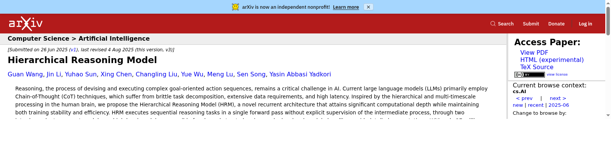

# arXiv Classic Red

A lightweight browser extension that restores the classic red arXiv header
(the pre-2026 "Campus Red" look) on arxiv.org.

Not affiliated with or endorsed by arXiv.

## What it does

- Turns the site header back to the classic red `#b31b1b`.
- Makes the logo and navigation text white, as in the old header.
- Fixes hover and mobile-menu colors so nothing flashes the new dark brown.
- Click the toolbar icon to toggle the styling on/off (an `OFF` badge shows
  the disabled state; open arXiv tabs reload to apply the change).

## Resource footprint

- The styling itself is one static CSS file; **no code runs inside arXiv
  pages**, ever.
- The only JavaScript is an event-driven MV3 service worker that wakes up
  when you click the toolbar icon and sleeps otherwise.
- No tracking, no analytics, no network requests, no data collection.

## Install

For Edge users, the recommended way is to install directly from the
[Microsoft Edge Add-ons store](https://microsoftedge.microsoft.com/addons/detail/arxiv-classic-red/bgpfbngpinanaaomkoaifcbfdbdmahij) —
one click, and updates arrive automatically.

For Chrome and other Chromium-based browsers, install manually from source:

1. Clone or download this repository.
2. Open `chrome://extensions` (or your browser's extensions page).
3. Enable **Developer mode**.
4. Click **Load unpacked** and select this folder.

## Color

The red is `#b31b1b` (historical arXiv/Cornell red) with `#8f1717` for hover.
Change `--classic-red` / `--classic-red-dark` in `classic-red.css` if you
prefer the `#ae2a24` toolbar red some users reported.

## License

[MIT](LICENSE)
